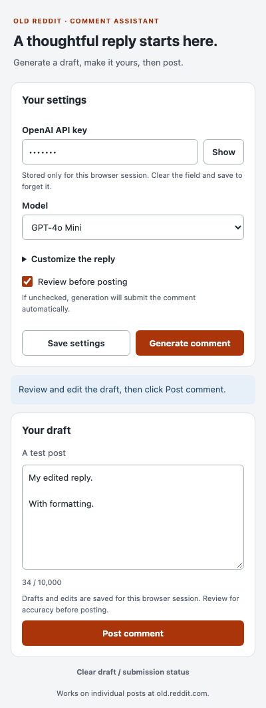

# Reddit Auto Commenter

A Chrome extension for drafting and posting comments on individual posts at
`https://old.reddit.com`. It sends the post's title, visible selftext, and your
optional context to OpenAI.

Review before posting is enabled by default. Generated drafts and edits survive
closing the popup during the same browser session.

## Install

1. Download or clone this repository.
2. Open `chrome://extensions`, enable **Developer mode**, and select **Load unpacked**.
3. Select the repository folder containing `manifest.json`.
4. Open an individual post on old Reddit and log into Reddit.
5. Open the extension, enter an OpenAI API key, and save your settings.

The extension requires Chrome 102 or newer. Development and browser tests use
Node.js 24 and the Chromium version installed by Playwright.

## Use

1. Choose a model available to your API account.
2. Optionally expand **Customize the reply** to add writing preferences or context.
3. Click **Generate comment**.
4. Review and edit the draft, then click **Post comment**.
5. Wait for confirmation that Reddit displayed your new comment.

Unchecking **Review before posting** enables automatic submission after generation.
The extension preserves existing text in Reddit's comment box; save or clear that
text yourself before using the extension.



## Privacy and storage

- API keys are held in Chrome session storage, not synchronized storage.
- Re-enter the key after restarting the browser or reloading/disabling the extension.
- To forget the key immediately, clear its field and click **Save settings**.
- Preferences persist locally on this device. Drafts and edits last for the browser session.
- Older synchronized settings are migrated locally, and the old synchronized key is removed after migration succeeds.
- Post text and your context are sent to OpenAI when you generate. Comments are sent to Reddit when you approve posting or enable automatic submission.

## Limits and recovery

- Only individual old Reddit post pages are supported; feeds and other Reddit frontends are rejected.
- Linked articles, image contents, videos, and comment threads are not fetched or analyzed.
- Context fields allow 4,000 characters each; post text allows 30,000 characters.
- Drafts allow 10,000 characters. Incomplete or empty model responses are rejected.
- Generation times out after 25 seconds. Submission confirmation times out after 20 seconds.
- Reddit rejection, a lost connection, or uncertain confirmation requires checking the page before another attempt. The extension never automatically retries submission.
- Locked, archived, restricted, or logged-out pages may not offer a usable comment form.
- Model availability, Reddit markup, account restrictions, and actual network behavior can change.

## Development

```bash
npm ci
npm run check
npm test
npx playwright install chromium
npm run test:ui
npm run test:extension
npm run format:check
```

Reload the extension in Chrome after source changes. Reload open Reddit pages too,
so their content scripts use the updated code.

Tests use simulated API responses and Reddit pages. They do not spend credits or
post publicly. See [TECHNICAL.md](TECHNICAL.md) for architecture, failure handling,
and the manual verification checklist.

## License

MIT. See [LICENSE](LICENSE).
